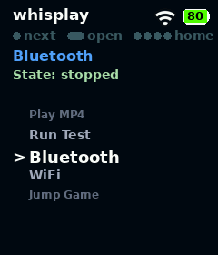
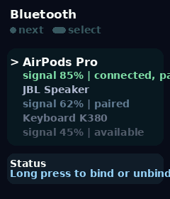
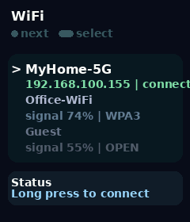

[English](README.md) | [中文](README_CN.md)

# PiSugar Whisplay 扩展板驱动

## 项目概览

本项目为 **PiSugar Whisplay 扩展板** 提供完整的驱动程序支持，让您可以轻松控制板载的 LCD 屏幕、物理按键和 LED 指示灯，并支持音频功能。

**支持平台：**
- Raspberry Pi（所有带 40-pin 排针的型号）
- Radxa ZERO 3W (RK3566)
- Radxa Cubie A7Z (Allwinner A733)

更多详细信息请参考 [Whisplay HAT 文档](https://docs.pisugar.com/docs/product-wiki/whisplay/intro)

---

### **💡 总线信息提示 💡**

设备使用了 **I2C、SPI、I2S** 总线。其中 **I2S 和 I2C 总线** 用作音频驱动，会在安装驱动的时候自动启用。

---

### 安装

克隆项目后，统一使用自动识别安装入口：

```bash
git clone https://github.com/PiSugar/Whisplay.git --depth 1
cd Whisplay
sudo bash install_driver.sh
sudo reboot
```

> ⚠️ **重要硬件警告（仅 A7Z）**  
> 由于电路不兼容，Whisplay HAT 的物理按键在 Radxa Cubie A7Z 上**不可使用**。  
> **请勿点击按键**，否则可能导致 A7Z 立即断电。

使用示例脚本测试硬件功能：

```shell
cd Whisplay/example
sudo bash run_test.sh
```

### Whisplay Daemon 服务

`whisplay-daemon` 是可选的本地服务，统一管理 LCD、背光、RGB LED、按键事件和 app 前台切换。（单击切换 app，长按启动app，4下快速点击请求退出）

当前 daemon 还内置了两个系统入口：

- `Bluetooth`：进入内部页面后可扫描附近蓝牙设备，并对选中设备执行绑定/解绑
- `WiFi`：进入内部页面后可扫描附近 Wi‑Fi，选择网络并连接；加密网络会进入单按键密码页，密码输入依赖设备接入的外接键盘

<p align="center">
  
  &nbsp;&nbsp;
  
  &nbsp;&nbsp;
  
</p>
<p align="center"><em>左：桌面 App 列表 &nbsp;|&nbsp; 中：蓝牙管理 &nbsp;|&nbsp; 右：WiFi 连接</em></p>

如果你使用了 daemon，建议其他 app 不要直接访问硬件，而是通过注册到 daemon 来获取前台控制权和共享 framebuffer 访问。

安装并启动命令：

```shell
sudo bash daemon/install_whisplay_daemon_service.sh
systemctl status whisplay-daemon.service --no-pager
```

安装完成后，daemon 设置保存在 `~/.whisplay-daemon/settings.json`，app 入口从 `~/.whisplay-daemon/app/` 加载。

daemon 设置示例：

```json
{
  "apps_dir": "~/.whisplay-daemon/app",
  "pisugar_home_button": "single"
}
```

`pisugar_home_button` 用于控制 PiSugar 的哪个按键事件会触发“从前台 app 返回 daemon 首页”。支持 `single`、`double`、`long`、`none`，默认值为 `single`。

查看 daemon 日志：

```shell
journalctl -u whisplay-daemon.service -f
```

如果某个 app 配置了 `use_daemon_default_log: true`，它的 stdout/stderr 会追加到：

```shell
tail -f ~/.whisplay-daemon/daemon-app.log
```

### 项目结构

仓库根目录现在按职责拆分：

- `runtime/`：Python 运行时模块，包括 `whisplay.py` 和 `whisplay_client.py`
- `install_driver.sh`：自动识别平台的驱动安装入口
- `script/`：平台安装脚本
- `daemon/`：本地硬件 daemon、其服务安装脚本，以及 `default_apps/`
- `audio/`：音频安装资源和 DTS overlay
- `example/`：面向用户的示例程序

#### 1. `runtime/whisplay.py`

  * **功能**: LCD、物理按键和 LED 的公开 Python 入口。
  * **快速验证**: 参考 `example/test.py` 文件，快速测试 LCD、LED 和按键功能。

#### 1.1 `runtime/whisplay_client.py`

  * **功能**: daemon 模式的 Python 客户端 helper。

#### 1.2 `daemon/whisplay_daemon.py`

  * **功能**: 可选的本地硬件守护进程，独占 LCD、背光、RGB LED、按键和 app 生命周期，并通过本机 Unix Socket 暴露 app 注册、切换和共享 framebuffer 接口。
  * **协议**: 按行分隔的 JSON，固定 `version: 1`
  * **默认 Socket 路径**: `/tmp/whisplay-daemon.sock`
  * **支持命令**: `health.ping`、`app.register`、`app.list`、`app.launch`、`app.focus.acquire`、`app.focus.release`、`app.exit.request`、`framebuffer.acquire`、`backlight.set`、`led.set`、`led.fade`、`button.get_state`、`events.subscribe`
  * **桌面交互**: 单击切换 app、长按启动/切到前台，前台 app 内快速按 4 下请求退出并回到桌面
  * **内建系统页**: 默认包含 `Bluetooth` 和 `WiFi` 两个入口，均由 daemon 自身渲染，无需外部 app 进程
  * **WiFi 输入方式**: 选择加密网络后会进入单按键密码页；密码输入依赖外接键盘（方向键/回车/退格/ESC）
  * **PiSugar 返回集成**: 如果系统中运行了 `pisugar-server`，daemon 会根据 `~/.whisplay-daemon/settings.json` 中的 `pisugar_home_button` 自动绑定 `single`、`double` 或 `long` 作为“返回首页”事件；设为 `none` 可关闭此功能
  * **安装为服务**:
    ```shell
    sudo bash daemon/install_whisplay_daemon_service.sh
    ```
  * **安装结果**: 安装脚本会写入 `~/.whisplay-daemon/settings.json`，并把默认示例 app 的 JSON 同步到 `~/.whisplay-daemon/app/`

#### 2. WM8960 音频驱动

  * **来源**: 音频驱动支持由 Waveshare（Raspberry Pi）提供，或使用自定义 overlay（Radxa）。

  * **安装**:
    - **自动识别**: 运行 `install_driver.sh`
    - **Raspberry Pi**: 运行 `script/install_raspberry_pi.sh`
    - **Radxa ZERO 3W**: 运行 `script/install_radxa_zero3w.sh`
    - **Radxa Cubie A7Z**: 运行 `script/install_radxa_cubie_a7z.sh`

    ```shell
    sudo bash install_driver.sh
    # 或按平台手动执行:
    sudo bash script/install_raspberry_pi.sh
    # Radxa ZERO 3W:
    sudo bash script/install_radxa_zero3w.sh
    # Radxa Cubie A7Z:
    sudo bash script/install_radxa_cubie_a7z.sh
    ```

#### 3. `audio/wm8960-radxa-zero3.dts`（仅限 Radxa）

  * **功能**: Radxa ZERO 3W (RK3566) 上 WM8960 编解码器的设备树 overlay 源文件，配置 I2C3 和 I2S3 音频接口。
  * **说明**: 此文件会由 `install_radxa_zero3w.sh` 自动编译并安装。

#### 4. `audio/wm8960-cubie-a7z.dts`（仅限 Radxa）

  * **功能**: Radxa Cubie A7Z (Allwinner A733) 上 WM8960 编解码器的设备树 overlay 源文件，配置 TWI7 和 I2S0 音频接口。
  * **说明**: 此文件会由 `install_radxa_cubie_a7z.sh` 自动编译并安装。


## 示例程序

`example` 目录下提供 4 个示例程序，如果你正在使用whisplay-daemon，你可以直接在 daemon 的桌面上看到它们的入口；如果没有使用 daemon，可以直接运行这些脚本来测试硬件功能和体验示例应用。

#### `run_test.sh`

  * **功能**: 运行完整硬件测试流程，覆盖屏幕、LED、扬声器、按键、麦克风和回放。
  * **使用方法**:
    ```shell
    cd example
    pip install -r requirements.txt --break-system-packages
    bash run_test.sh
    ```
    **效果**: 程序会先显示 logo 倒计时，再逐步展示每一项测试内容，并在最后显示简洁汇总结果。

#### `play_mp4.py`

  * **功能**: 在 LCD 屏幕上播放 MP4 视频文件。
  * **前置条件**: 确保系统已安装 `ffmpeg`：
    ```shell
    sudo apt-get install ffmpeg
    ```
  * **下载测试视频**:
    将示例 MP4 视频下载到 `example/data` 目录：
    ```shell
    cd example
    wget -O data/whisplay_test.mp4 https://img-storage.pisugar.uk/whisplay_test.mp4
    ```
  * **使用方法**:
    在 `example` 目录下执行：
    ```shell
    sudo python3 play_mp4.py --file data/whisplay_test.mp4
    ```
    **效果**: 指定的 MP4 视频将在 LCD 屏幕上播放。

#### `flappy_bird.py`

  * **功能**: 单按键 Flappy Bird 小游戏，带游戏音效。
  * **使用方法**:
    ```shell
    cd example
    sudo python3 flappy_bird.py
    ```
    **效果**: 短按控制小鸟上升，包含分数统计和 WM8960 音效输出。

#### `jump_game.py`

  * **功能**: 单按键“跳一跳”小游戏，带模拟 3D 倾斜视角和音效。
  * **使用方法**:
    ```shell
    cd example
    sudo python3 jump_game.py
    ```
    **效果**: 按住蓄力、松开跳跃，画面和性能针对 Pi Zero 2W 做了优化。


**注意：本软件目前支持：**
- **Raspberry Pi**: 官方 full 版本操作系统
- **Radxa ZERO 3W**: Debian 12 (bookworm) 官方镜像
- **Radxa Cubie A7Z**: Debian 11 (bullseye) 官方镜像

**A7Z 安全提示：** 在 Radxa Cubie A7Z 上，请**不要点击 Whisplay HAT 的物理按键**。由于电路不兼容，点击可能导致设备立即断电。

## 相关链接

- [PiSugar Whisplay Docs](https://docs.pisugar.com/docs/product-wiki/whisplay/intro)
- [Third-Party App Integration Guide](APP_INTEGRATION.md)
- [第三方 App 接入指南](APP_INTEGRATION_CN.md)
- [whisplay-ai-chatbot](https://github.com/PiSugar/whisplay-ai-chatbot)
- [whisplay-lumon-mdr-ui](https://github.com/PiSugar/whisplay-lumon-mdr-ui)
